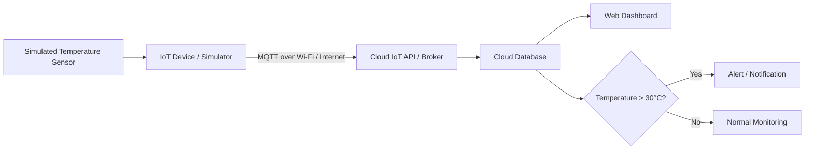

# SWYNEX IoT System Map

## Task 1 — Room Temperature Monitoring System

### 1. Use Case
This project maps a simple IoT system for monitoring room temperature without requiring physical hardware.

**Goal:** Collect simulated temperature readings, send them through a connectivity layer to a cloud service, store/process the data, and display the information on a dashboard.

**Example scenario:** A school, office, or server room wants to monitor temperature remotely and receive an alert when the temperature becomes too high.

---

## 2. IoT Components

| Layer | Component | Purpose |
|---|---|---|
| Sensor | Temperature sensor (simulated) | Measures room temperature in °C |
| Edge/device | IoT device or simulator | Reads the sensor value and prepares the data |
| Connectivity | Wi-Fi / MQTT over the Internet | Transports sensor data to the cloud |
| Cloud | IoT cloud/API + database | Receives, stores, and processes readings |
| Dashboard | Web dashboard | Displays current temperature and historical data |
| Alert | Cloud rule/notification service | Sends an alert when temperature exceeds a threshold |

**No physical hardware is required:** the sensor readings are simulated digitally.

---

## 3. System Architecture



### Data flow
1. The simulated temperature sensor generates a reading.
2. The IoT device/simulator reads the value.
3. The reading is packaged as sensor data.
4. MQTT transports the data through the Internet to the cloud.
5. The cloud service receives and validates the message.
6. The reading is stored in a cloud database.
7. The dashboard retrieves the data and displays current/historical temperature.
8. A cloud rule checks the temperature against a threshold.
9. If the temperature is above **30°C**, an alert is generated.

---

## 4. Example Sensor Data

A simulated reading can be represented as:

```json
{
  "device_id": "ROOM-001",
  "sensor": "temperature",
  "value": 28.5,
  "unit": "C",
  "timestamp": "2026-10-01T10:00:00Z"
}
```

Another example when the temperature is too high:

```json
{
  "device_id": "ROOM-001",
  "sensor": "temperature",
  "value": 32.1,
  "unit": "C",
  "timestamp": "2026-10-01T10:05:00Z"
}
```

The second reading would trigger the configured high-temperature alert.

---

## 5. Connectivity

**Protocol:** MQTT

MQTT is suitable for IoT because it is lightweight and follows a publish/subscribe model.

Example topic:

```text
swynex/rooms/ROOM-001/temperature
```

The simulated device publishes temperature readings to this topic, while the cloud service subscribes to it.

---

## 6. Cloud and Dashboard

### Cloud responsibilities
- Receive MQTT messages
- Validate incoming data
- Store readings
- Apply alert rules
- Provide data to the dashboard

### Dashboard could display
- Current temperature
- Minimum and maximum temperature
- Average temperature
- Temperature history graph
- Device status
- High-temperature alerts

Example dashboard view:

```text
+--------------------------------------+
|       ROOM TEMPERATURE MONITOR       |
+--------------------------------------+
| Device: ROOM-001      Status: ONLINE |
|                                      |
| Current Temperature: 28.5 °C         |
|                                      |
| 30°C |                    *           |
| 28°C |       *    *    *             |
| 26°C | *  *                         |
|      +----------------------------   |
|        10:00  10:05  10:10  10:15   |
|                                      |
| Alert: NORMAL                        |
+--------------------------------------+
```

---

## 7. End-to-End Summary

**Sensor → IoT Device/Simulator → MQTT/Internet → Cloud IoT Service → Database → Dashboard → Alert**

This architecture demonstrates the main IoT flow without requiring physical hardware. The sensor and device can be simulated using software, while the cloud and dashboard represent the services that would be used in a real deployment.

---

## 8. Possible Real-World Extensions

The same architecture could later be extended to:
- Multiple rooms
- Humidity monitoring
- Motion detection
- Automatic fan/AC control
- Mobile notifications
- User authentication
- Historical analytics
- Predictive maintenance

---

## 9. Project Information

**Internship:** SWYNEX  
**Task:** Task 1 — IoT System Map  
**Use case:** Room Temperature Monitoring  
**Hardware:** Not required; sensor data is simulated  
**Repository name:** `SWYNEX-IoT-System-Map`
